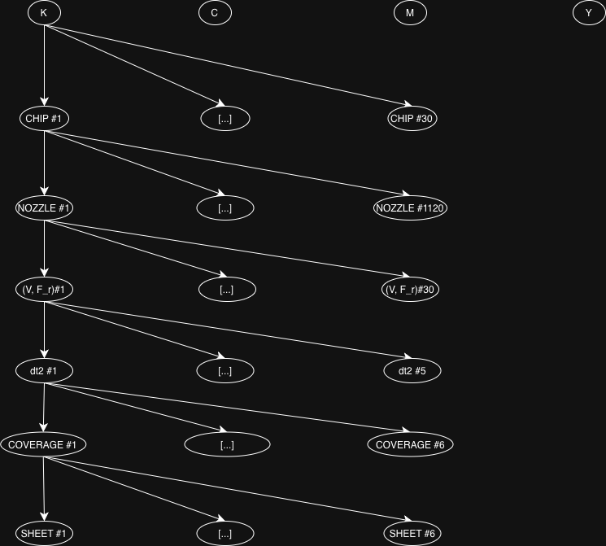
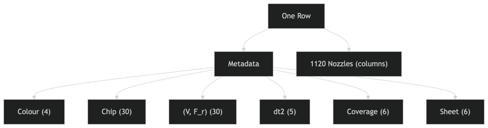

# Dataset Structure Understanding

Since I still don't SEE how the dataset actually represents irl data I'll try to illustrate it here so it clicks.

### Data Hierarchy 

This is the actual data hierarchy, not the way it is currently represented in the dataset:

IF the dataset was structured in this way, there would be one row per nozzle measurement, and the table would look like this:

| Sheet  | Color | Chip | Nozzle | V   | F_r | dt2 | Coverage | Value |
|--------|-------|------|--------|-----|-----|-----|----------|-------|
| 980301 | C     | 1    | 0      | ... | ... | ... | ...      | 0.118 |
| 980301 | C     | 1    | 1      | ... | ... | ... | ...      | 0.112 |
| 980301 | C     | 1    | 2      | ... | ... | ... | ...      | 0.107 |

HOWEVER, the dataset is stored in a wide format.

This means that the table looks like:

| SheetId# | Color$ | HeadIdx# | V    | F_r  | dt2     | Coverage# | Value_000# | Value_001# | Value_002# | ... |
|----------|--------|----------|------|------|---------|-----------|-------------|-------------|-------------|-----|
| 980301   | C      | 1    | 20.0 | 1.02    | -1100.0   | 2.0         | 0.11846     | 0.11272     | 0.10702 | ... |

Each row is one experimental condition (sheet_id, colour, headId, V, f_R, dt2, coverage), and then 1136 measurements across space (nozzles). This is basically image-like data:

each row = a “scanline” / “print pass”
each value_XXXX = spatial position (nozzle index)

So we treat nozzle values as a vector of measurements per condition.

## Nozzle Measurements

But what exactly is the value we're measuring? They are Scanner Density values:

Scanner Density tells us something about how dark a colour is:

• 0 means there is no colour at all

• 1 means the darkest possible colour

They are continuous measurements per nozzle.